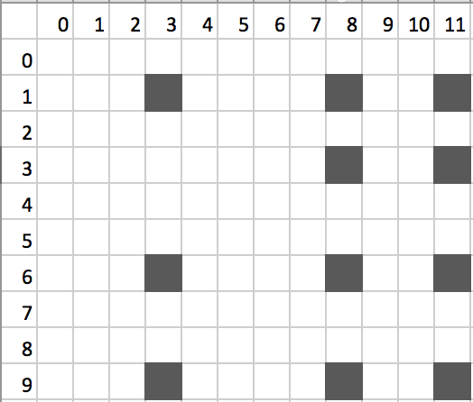
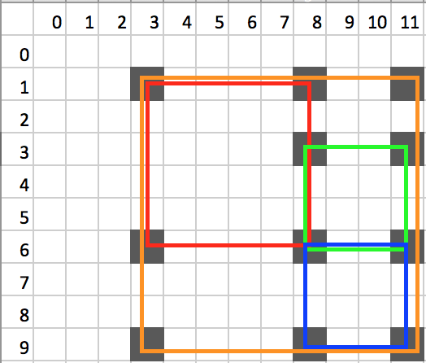

# Squares on a map

**Goal:** Find the squares in a map of points.

## Task
Your program will read coordinates of points in an NxM map.
Then, the program will report the squares than can be formed
with these points.

Your task is split into two. 
First, you have to read map data from a file,
and build a `Map` object.
Then, you need to process that `Map` object and find the 
squares one can form on that map.

### Reading the file
A map data file's first line is the size of the map.
Next, the coordinate of a point comes on each line.

Indexing of the points in the input starts from 0.
The points may be listed in any order.

Here is a sample file, where there are 11 points in a 10x12 map.
The first point is at coordinate (1,3),
the next is at (6,3), the next is at (1,8), and so on. 

```
10 12
1 3
6 3
1 8
1 11
3 8
3 11
6 8
6 11
9 3
9 8
9 11
```

A visualization of the point map above is as follows:



### Finding the squares

There are 4 possible squares on the sample map above:

* top-left corner is at (1,3), side length is 5.
* top-left corner is at (1,3), side length is 8.
* top-left corner is at (6,8), side length is 3.
* top-left corner is at (3,8), side length is 3.

A visualization of these square are as follows:



Devise and implement an algorithm to find these squares.